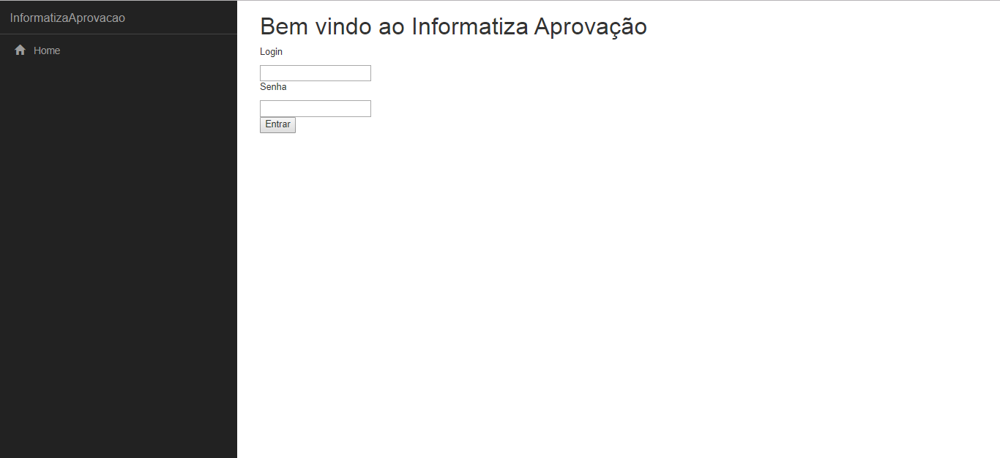

# Informatiza Aprovação
> Sistema que consome uma webApi para obter informações sobre propostas de fornecedores

A partir de um banco de dados com informações sobre usuários, fornecedores, propostas e histórico de propostas, foi feita uma engenharia reversa, criando uma webApi em AspNet Core com Scaffolding e Entity framework.
Já o front-end foi feito utilizando o angular 2.



## Instalação

Windows:
- É necessário ter o node instalado na máquina. Para isso vá até o link, e instale a versão LTS:
```sh
https://nodejs.org/en/
```
- É necessário ter o npm. Para isso basta executar o seguinte comando no cmd:
```sh
npm install npm@latest -g
```
- É necessário ter o ASP. NET Core SDK e .NET Core SDK. Estes vem embutidos na instalação do visual studio.
- Abra o arquivo appsettings.json e mude a string de conexão do banco de dados.
- Para Rodar a aplicação, basta ir até o diretório do projeto com o cmd e executar o seguinte comando:
```sh
dotnet run
```

## Funcionamento do sistema

Foram implementadas as seguintes funcionalidades:
- Login: É possível fazer login no sistema. Ao digitar o login e senha, o sistema vai até o banco de dados autenticar essas informações(através da webApi).
- Adição, edição e remoção de usuário: Para o usuário admin, é possível gerenciar os usuários. É importante notar que ao cadastrar/editar um usuário , a senha deve ter 8 caracteres.
- Lista de propostas: O sistema mostra para todos os usuários a lista de proposta de fornecedores do sistema.
- Pesquisar proposta: É possível pesquisar por propostas no sistema. Os campos Nome do Fornecedor, nome da proposta e categoria são obrigatórios.
- O usuário admin pode deletar propostas.

## Arquitetura utilizada

Como mencionado anteriormente, foi feita uma engenharia reversa para a criação da web Api. A partir do banco de dados que esta disponível na raiz do repositório, foi criada a API para a comunicação com o banco de dados. Esta api contém todos os controllers necessários para a comunicação com qualquer tabela do banco, mesmo aquelas que não foram usadas.
Já no frontend foi utilizado o angular 2 com algumas diretivas do bootstrap para desing dos formulários. Todas as interfaces e serviços necessários para a conexão com o banco foram criados, mesmo para as tabelas que não foram utilizadas.

## Bugs no sistema a serem melhorados

- Tive dificuldade em tratar as datas presentes em algumas tabelas do banco. Por isso em algumas telas esse campo está sem informação.
- É preciso melhorar o design do frontend, nenhums folha de estilos foi criada para tratar os elementos de tela, isso deixa o sistema com um aspecto meio ultrapassado. 
Minha ideia seria utilizar algum framework para o css, como o materialize, mas faltou tempo.

## Funcionalidades que ainda não foram implementadas

- Falta editar e cadastrar novas propostas no sistema. Essa funcionalidade seguiria a mesma linha da adicionar usuário, porém o id do fornecedor e da categoria devem ser buscados antes nessas respectivas tabelas(pois a tabela proposta não guarda o nome do fornecedor e nem a categoria, mas sim o id dos dois).

- Falta aprovar uma proposta no sistema. Para isso deve ser considerada a data da proposta, fazendo uma busca na tabela proposta. Isso não foi implementado pois tive problemas para trabalhar com as datas. Além disso deveria ser salvo na tabela historico_proposta o id do usuário que aprovou a mesma.

- Falta adicionar um arquivo de proposta. Para isso deveria ser aberto uma janela para selecionar o arquivo. Logo após o caminho desse arquivo deveria ser salvo na tabela proposta.

- Falta poder visualizar o arquivo de proposta.
- Gerenciar o status das propostas de fornecedores.

Todas essas funcionalidades podem ser feitas sem maiores problemas, pois toda a base já foi criada. Só não foi feito pois faltou tempo.
